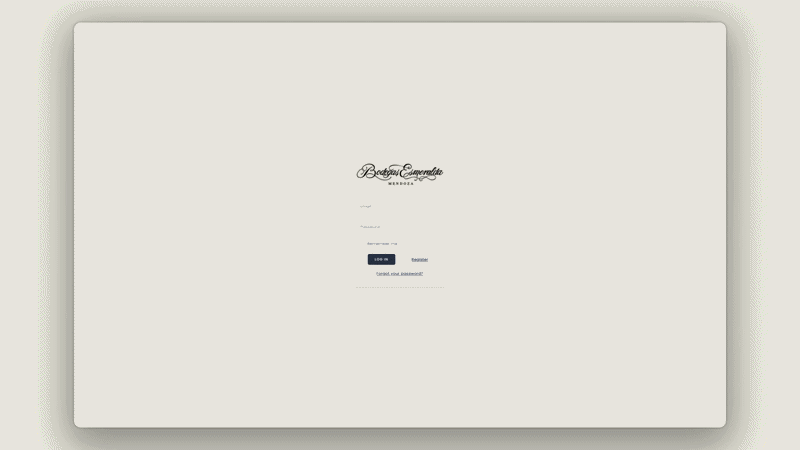
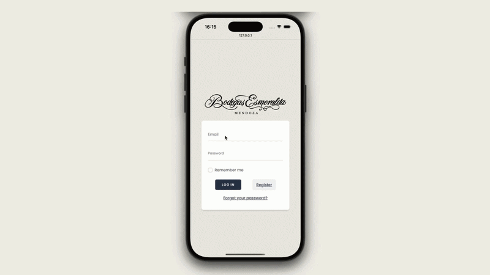

# Bodega Esmeralda

An interactive web application built as part of the **Webapplicaties I & II** course (Second-Year Software Engineering project). Bodega Esmeralda provides a dashboard and management system featuring data visualization and geographical mapping.

<div align="center">
  
</div>

---

## 📸 Screenshots & Demo

### Application Walkthrough
Here is a demonstration of the Bodega Esmeralda application on different devices:

**Desktop View:**  
<p align="center">
  
</p>

**Mobile View:**  
<p align="center">
  
</p>

---

## 🚀 Technologies Used
This project utilizes a modern and robust tech stack:
- **Framework:** [Laravel 11.x](https://laravel.com/)
- **Frontend Engine:** [Vue.js 3](https://vuejs.org/) & [Inertia.js](https://inertiajs.com/)
- **Styling:** [Tailwind CSS](https://tailwindcss.com/)
- **Data Visualization & Mapping:** Chart.js (`vue-chartjs`) & Leaflet
- **Language Requirements:** PHP 8.2+, Node.js 18+

## ⚙️ Prerequisites
Before running the project locally, ensure you have the following installed:
- [PHP](https://www.php.net/) ^8.2
- [Composer](https://getcomposer.org/)
- [Node.js](https://nodejs.org/) and NPM

## 🛠️ Installation & Setup

1. **Clone the repository:**
   ```bash
   git clone <your-repository-url>
   cd bodega-esmeralda
   ```

2. **Install PHP and Node dependencies:**
   ```bash
   composer install
   npm install
   ```

3. **Set up environment variables:**
   ```bash
   cp .env.example .env
   php artisan key:generate
   ```
   *Make sure to configure your database settings in the `.env` file if you are not using the default SQLite setup.*

4. **Initialize the Database:**
   Run migrations and seed the database with initial data:
   ```bash
   # Note: running this will recreate all tables and fill them with data from the seeders.
   php artisan migrate:fresh --seed
   ```

## 💻 Running the Application

To run the application locally, start the Vite development server and the Laravel local server concurrently. 

Using the custom composer script (this will start the server, queue, and vite automatically):
```bash
composer run dev
```

**Or manually in separate terminal windows:**
```bash
# Terminal 1: Run Vite for frontend compiling
npm run dev

# Terminal 2: Run Laravel backend
php artisan serve
```

## ⏱️ Scheduled Commands & Workers
The application interacts with the IWA to periodically fetch weather data. 

List all scheduled tasks and their time until execution (requires worker to be active):
```bash
php artisan schedule:list
```

Run the schedule worker to process scheduled commands:
```bash
php artisan schedule:work
```

**Manual Query Commands:**
- Query temperatures of the current hour from IWA and save to the database:
  ```bash
  php artisan query-save:temperatures
  ```
- Query humidities of today from IWA and save to the database:
  ```bash
  php artisan query-save:humidity
  ```


---
*Created as an educational project for the HBO-ICT Software Engineering program.*
